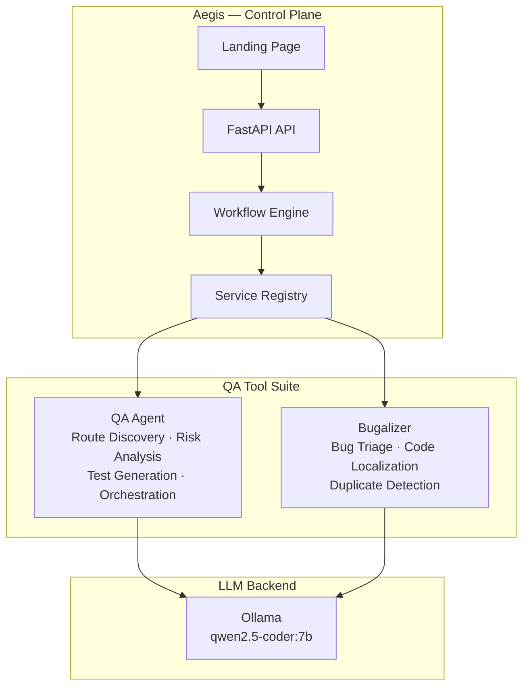

# Aegis

**The AI Quality Control Plane**

Aegis is a lightweight orchestration layer that unifies AI-powered QA tools into a single control plane. It coordinates route discovery, test generation, bug triage, and fix proposals across your development workflow.

## Architecture



## Quick Start

```bash
# Install
pip install -e ".[dev]"

# Configure
cp .aegis.yaml.example .aegis.yaml
# Edit .aegis.yaml with your service URLs

# Check service status
aegis status

# Run the full QA pipeline
aegis run full_pipeline

# Start the API server + landing page
aegis serve
```

## Tools

| Tool | Description | Features |
|------|-------------|----------|
| **QA Agent** | Route discovery, risk analysis, test generation & orchestration | Route Discovery, Risk Assessment, Test Generation, Test Orchestration, Branch Board |
| **Bugalizer** | AI-powered bug triage, code localization & fix proposals | Bug Triage, Code Localization, Duplicate Detection |

## CLI Commands

| Command | Description |
|---------|-------------|
| `aegis status` | Show all services and their health status |
| `aegis serve` | Start API server and serve landing page |
| `aegis run <workflow>` | Execute a named workflow pipeline |
| `aegis config show` | Print resolved configuration |

## API Endpoints

| Endpoint | Method | Description |
|----------|--------|-------------|
| `/health` | GET | Aegis health check |
| `/api/services` | GET | List services with health status |
| `/api/services/{name}/health` | GET | Live health check for one service |
| `/api/workflows/{name}/run` | POST | Trigger a named workflow |
| `/api/portfolio` | GET | Tool metadata for landing page |

## Configuration

Aegis uses `.aegis.yaml` for configuration. See `.aegis.yaml.example` for the full schema.

Environment variables can be interpolated using `${VAR_NAME}` syntax:

```yaml
services:
  qaagent:
    url: ${QAAGENT_URL:-http://localhost:8080}
```

## License

MIT
